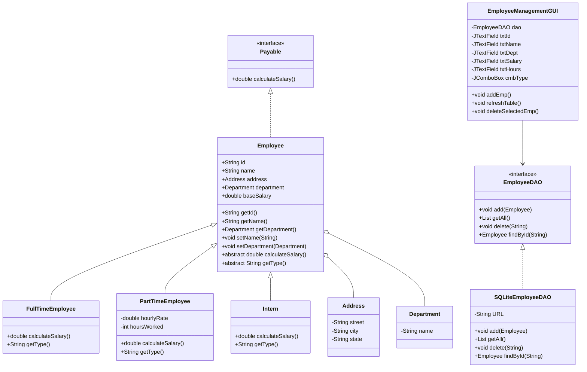

# Employee Management System (EMS) Documentation

## 1. Project Summary

**Project Title:** Employee Management System (EMS)

**University:** Adama Science and Technology University

**Group Members:**
- Shimellis Regassa — Ugr/37774/17
- Kumala Adugna — Ugr/37298/17
- Merga Adam — Ugr/37391/17
- Fedawak Hailu — Ugr/36856/17
- Midaga Buzuna — Ugr/37416/17

**Instructor:** Mr. Megersa Daraje

**Date:** May 2026

**Version:** 1.0.0

## 2. Objective

The Employee Management System is a Java Swing desktop application for registering, viewing, and deleting employees. It stores records in a local SQLite database and demonstrates a clean Object-Oriented Programming (OOP) design with separation between the user interface, business logic, and data persistence.

## 3. Technical Stack

- Language: Java 17
- GUI: Java Swing
- Database: SQLite
- Database Driver: `sqlite-jdbc-3.45.3.0.jar`
- Logging: SLF4J (`slf4j-api-2.0.9.jar`, `slf4j-simple-2.0.9.jar`)
- Build / Run: Standard Java tooling

## 4. High-Level Architecture

The system is organized into the following packages:

- `app/` — Application entry point
- `dao/` — Data Access Object layer for persistence
- `gui/` — Swing UI implementation
- `employee/` — Core employee domain models
- `interfaces/` — Shared contracts and behavior definitions

This architecture follows the Model-View-Controller style separation:
- Model: `employee/` and `dao/`
- View: `gui/`
- Controller: `gui/EmployeeManagementGUI` orchestrates between UI and data

## 5. OOP Design and Principles

### 5.1 Abstraction
- `Employee` is an abstract base class defining common employee properties.
- `Payable` is an interface that forces salary calculation behavior.

### 5.2 Inheritance
- `FullTimeEmployee`, `PartTimeEmployee`, and `Intern` extend `Employee`.
- Shared fields and behavior are reused from the parent class.

### 5.3 Polymorphism
- The application uses the `Employee` type to hold different subtypes.
- `calculateSalary()` is called on `Employee` references, and the runtime type determines the result.

### 5.4 Encapsulation
- Fields in `Employee`, `Address`, and `Department` are private or protected.
- Access is provided through constructors, getters, and setters.

### 5.5 Aggregation
- `Employee` contains references to `Address` and `Department`.
- These objects exist separately and are used to compose employee details.

## 6. Package and Class Overview

### `interfaces`
- `Payable` — Defines `double calculateSalary()`.

### `employee`
- `Employee` — Abstract base class for employees.
- `FullTimeEmployee` — Returns fixed `baseSalary`.
- `PartTimeEmployee` — Calculates `hourlyRate * hoursWorked`.
- `Intern` — Returns a fixed stipend stored in `baseSalary`.
- `Address` — Stores street, city, and state.
- `Department` — Stores the department name.

### `dao`
- `EmployeeDAO` — DAO interface with `add`, `getAll`, `delete`, and `findById`.
- `SQLiteEmployeeDAO` — SQLite implementation of the DAO.

### `gui`
- `EmployeeManagementGUI` — Swing UI for registration, viewing, and deletion.

### `app`
- `Main` — Starts the GUI safely on the Event Dispatch Thread.

## 7. Class Interaction and Flow

### Core Data Flow
1. User enters employee information in the Swing form.
2. `EmployeeManagementGUI.addEmp()` creates the appropriate employee subtype.
3. The object is passed to `SQLiteEmployeeDAO.add()` to persist the record.
4. `refreshTable()` calls `dao.getAll()` and displays records in the table.

### Database Mapping
- Stored table: `employees`
- Columns: `id`, `name`, `type`, `dept`, `salary`
- `SQLiteEmployeeDAO` reconstructs objects using `mapResultSetToEmployee()` and the employee `type`.

## 8. Database Design

### Table: `employees`
- `id` — TEXT, Primary Key
- `name` — TEXT
- `type` — TEXT
- `dept` — TEXT
- `salary` — REAL

### Persistence Notes
- Database file path: `db/ems.db`
- First run automatically creates the `db/` folder and `employees` table.
- `SQLiteEmployeeDAO` uses prepared statements to prevent SQL injection.

## 9. User Interface Behavior

### Main UI Features
- Employee registration form
- Employment type selector with conditional fields
- Data table showing all saved employees
- Delete selected employee feature
- Table refresh button

### Dynamic Fields
- `Worked Hours` field is only enabled when `Part-Time` is selected.

## 10. Installation and Run Instructions

### Prerequisites
- Install Java 17 JDK or later.
- Ensure the SQLite JDBC library files are available in `lib/`.

### Setup
1. Place the required JARs inside `lib/`:
   - `sqlite-jdbc-3.45.3.0.jar`
   - `slf4j-api-2.0.9.jar`
   - `slf4j-simple-2.0.9.jar`
2. Open the root folder in your Java IDE or code editor.
3. Add the JAR files to the project's classpath if not already referenced.

### Run
- Execute `app.Main`.
- The GUI will appear and create `db/ems.db` automatically if needed.

## 11. Deployment Notes

- Do not commit `db/ems.db` to version control.
- `.gitignore` already excludes `db/` and compiled `.class` files.
- Keep external libraries in `lib/` or use Maven/Gradle if converting to a build system.

## 12. Key Strengths of the Project

- Clear separation between UI, data persistence, and domain logic.
- Proper use of OOP patterns: inheritance, interfaces, and abstraction.
- Lightweight SQLite persistence with safe JDBC practices.
- User-friendly Swing interface with conditional input logic.

## 13. Recommended Improvements

- Add validation for empty fields and invalid numbers.
- Include update/edit employee functionality.
- Persist full `Address` information in the database.
- Add search and filter capabilities.
- Consider using a build tool like Maven or Gradle for dependency management.

## 14. Appendix: Class Diagram

